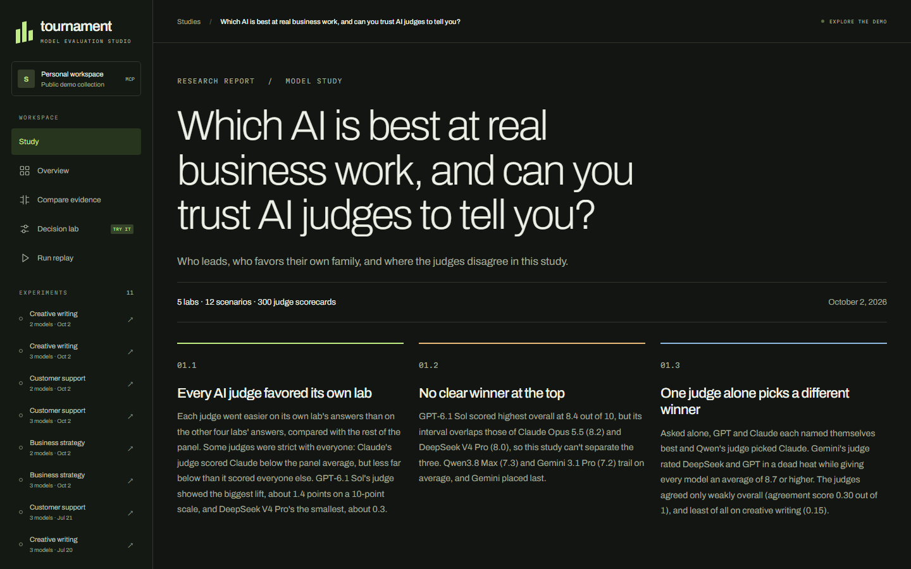
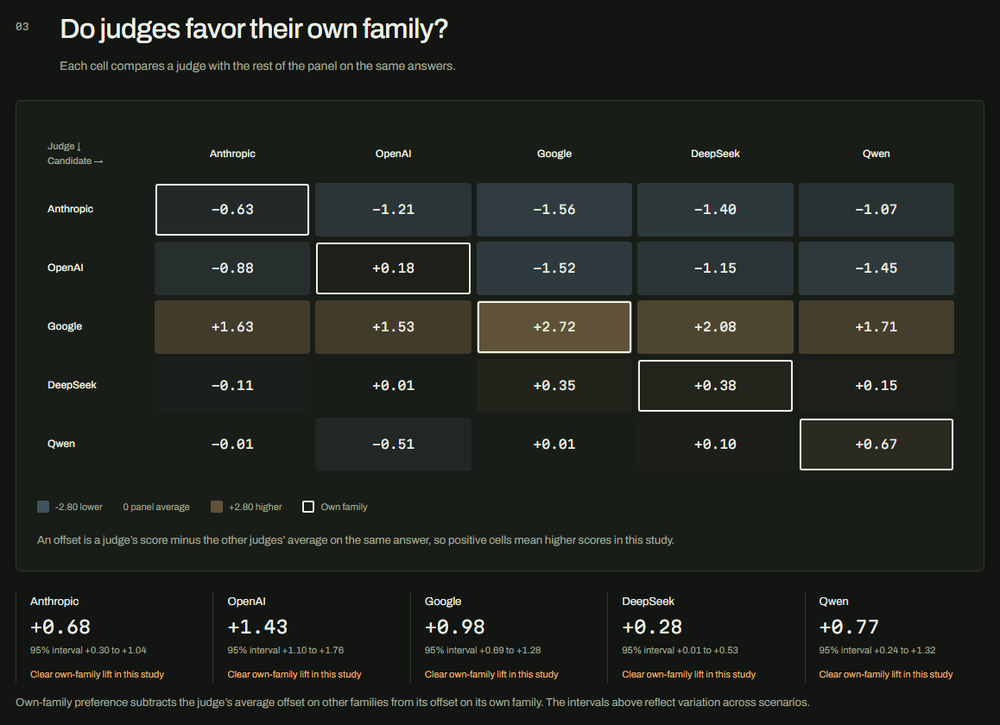
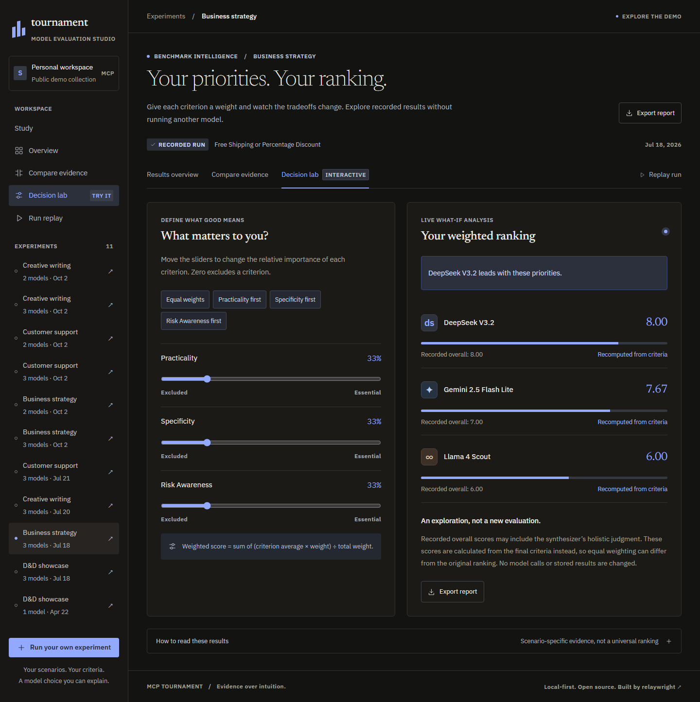
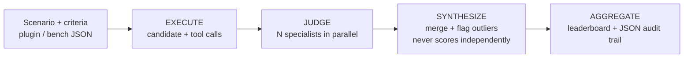
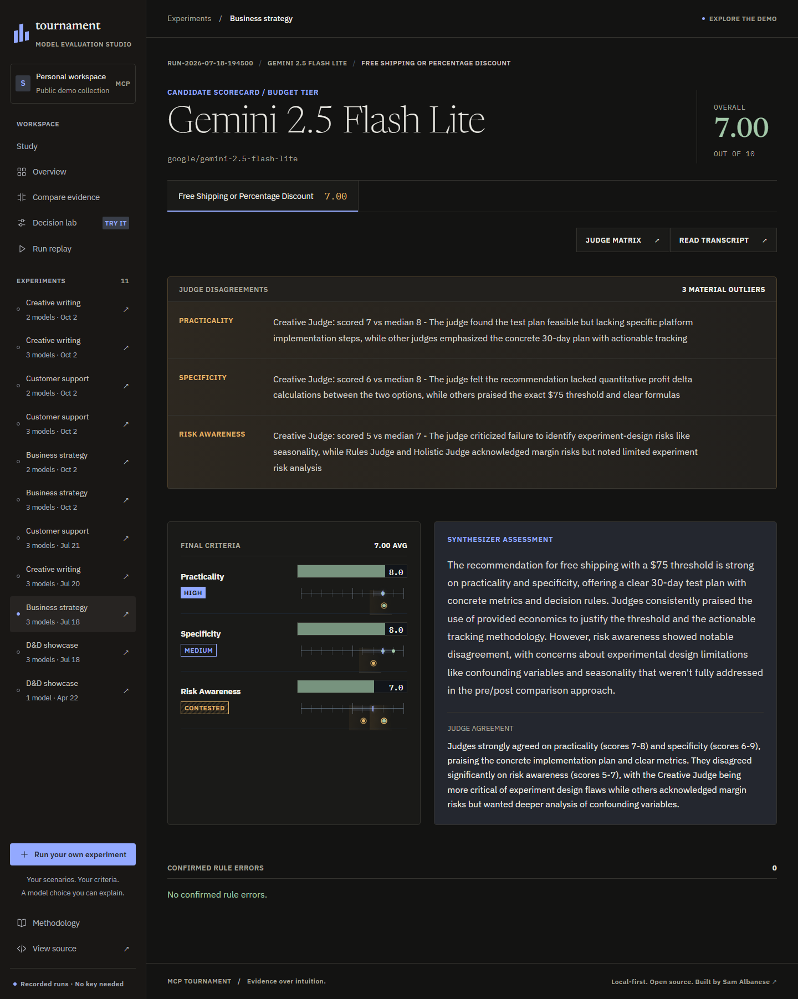
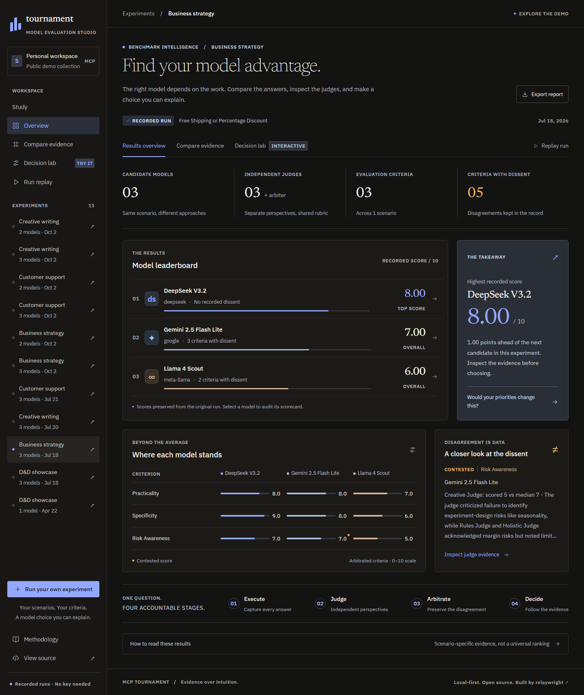
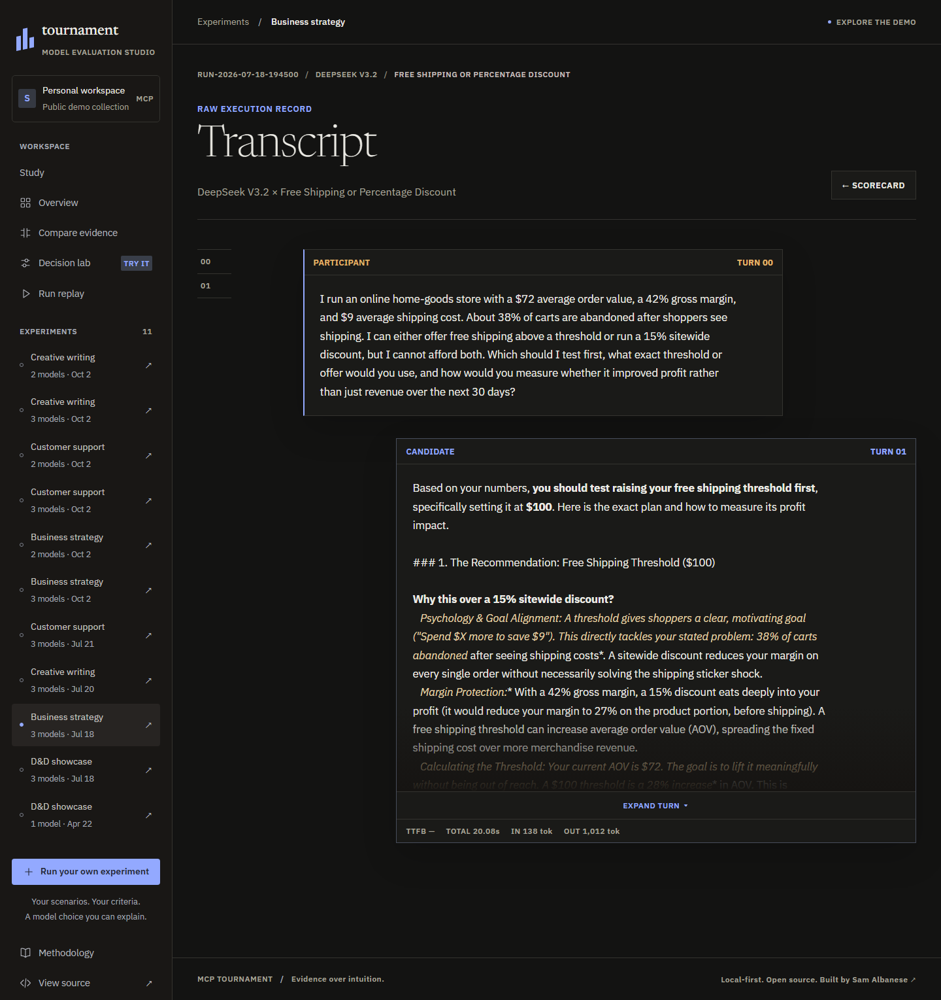

# mcp-tournament

[](https://github.com/relaywright/mcp-tournament/actions/workflows/ci.yml)


**In this study, all five AI judges went easier on their own lab's answers than on everyone else's.** Five frontier models answered twelve business scenarios and then judged each other blind. **[Read the findings](https://mcp-tournament.pages.dev/#/study/flagship-2026-10)**.

Build a custom LLM benchmark in a form, run it from a local GUI, MCP client, or CLI, and turn independent judge opinions into ranked, auditable results.



**[Explore the interactive demo](https://mcp-tournament.pages.dev/#/run/run-2026-07-18-194500)**: compare a recorded business-strategy experiment, inspect the evidence, and try your own criterion weights. No key needed.

Why this is interesting:

- **Disagreement is data:** multiple specialist judges score independently; the arbiter preserves outliers and explains where they diverged.
- **Benches are declarative:** anyone can define scenarios and criteria as JSON or build them in a form, no pipeline code required.
- **BYOK and local-first:** bring one OpenRouter key, keep the GUI on your machine, and run budget-tier tournaments for cents.

## The flagship study

Claude Opus 5.5, GPT-6.1 Sol, Gemini 3.1 Pro, DeepSeek V4 Pro and Qwen3.8 Max
each answered the same twelve scenarios across business strategy, customer
support and creative writing. Every model then scored every answer, its own
included, without seeing who wrote it: 300 scorecards in all.

- **Every judge favored its own lab.** Compared with the rest of the panel,
  each judge scored its own lab's answers more generously than it scored the
  other four labs. The lift ranged from about 0.3 points (DeepSeek) to 1.4
  points (GPT) on a 10-point scale, and every 95% interval sits above zero.
- **No clear winner at the top.** GPT-6.1 Sol led at 8.4, but its interval
  overlaps those of Claude Opus 5.5 (8.2) and DeepSeek V4 Pro (8.0), so the
  study can't separate the three.
- **One judge alone picks a different winner.** GPT and Claude each named
  themselves best when judging alone, and the panel agreed only weakly overall
  (Krippendorff's alpha 0.30).



The findings page links every number back to the transcripts and judge
reasoning behind it, and the raw scores download as CSV. Recorded API cost:
$7.25. Results apply to these scenarios and settings; the page lists what the
study does not show. To run your own, see [the study format](docs/STUDY_FORMAT.md).

## A model choice you can explain

The evaluation studio turns the recorded pipeline output into a decision workflow:

- **Results overview:** the original leaderboard, criterion comparisons, and material judge dissent in one place.
- **Compare evidence:** choose up to three candidates and inspect their original answers and arbiter assessments side by side.
- **Decision lab:** change the importance of each criterion with sliders or presets, then see the weighted ranking respond immediately.
- **Export a report:** download original scores, judge identities, dissent, and optional exploratory weights as Markdown.
- **Follow the evidence:** open any model's scorecard, individual judge matrix, transcript, or animated run replay.



The demo contains real, dated recordings across business strategy, customer support,
creative writing, and the D&D showcase. It makes no live model calls. Results are
scenario-specific observations, not a statistically validated or universal model
ranking. The decision lab recomputes scores from final criteria; it never changes
recorded results or hides missing evidence. Candidate and judge models may overlap.

## How it works


```mermaid
flowchart LR
    A["Scenario + criteria<br/>plugin / bench JSON"] --> B["EXECUTE<br/>candidate + tool calls"]
    B --> C["JUDGE<br/>N specialists in parallel"]
    C --> D["SYNTHESIZE<br/>merge + flag outliers<br/>never scores independently"]
    D --> E["AGGREGATE<br/>leaderboard + JSON audit trail"]
```

Three entry points feed the same pipeline:

- **GUI:** build benches, launch runs, and inspect results locally.
- **MCP client:** ask Claude Desktop, Cursor, or Windsurf to run, compare, and explain evaluations (8 tools, 5 resources, 4 prompts), including saving your own benches from chat.
- **CLI:** script runs, serve MCP over stdio, or print the leaderboard.

Domain logic is pluggable; the pipeline is not. Benches are declarative plugins:
a JSON file (or the Build Bench form) defines scenarios, rounds, an optional
simulated participant persona, and judging criteria. Code plugins can go further
with custom tools; see [docs/PLUGINS.md](docs/PLUGINS.md).

| Plugin | Domain | Kind |
|--------|--------|------|
| `business-strategy` | SMB pricing decision with real numbers to reason about | 📄 bench (JSON) |
| `creative-writing` | Opening chapter + 3 rounds with a developmental-editor persona | 📄 bench (JSON) |
| `customer-support` | Billing dispute with an escalating customer persona | 📄 bench (JSON) |
| `dnd` | Showcase: D&D 5e Dungeon Master with dice/damage tools and an LLM player | ⚙️ code plugin |
| `coding` | Code generation & review | ⚙️ code plugin |
| **Yours** | Build in the GUI (`#/build`), drop a JSON in `benches/`, or write TypeScript | 🛠 you |

## Why multi-judge?

Single evaluators miss things. A Rules judge catches mechanical errors; a Creative
judge catches boring output; a Holistic judge catches "would I keep using this?"
The synthesizer never scores independently: it arbitrates, flags outlier judges,
and records **why** they disagreed. Judge disagreements are first-class data,
rendered in the viewer:



## When to use this (and when not to)

| You want | Reach for |
|----------|-----------|
| CI-style assertions and regression gates over prompts at scale | [promptfoo](https://github.com/promptfoo/promptfoo) |
| Standardized academic benchmarks (MMLU, HellaSwag, …) | [lm-eval-harness](https://github.com/EleutherAI/lm-evaluation-harness) |
| Rubric-scored comparisons on **your own scenarios** (multi-round conversations, personas, tool use) with judge disagreement preserved instead of averaged away | **mcp-tournament** |

Those tools are better at what they do; this one is for judgment-heavy,
domain-specific evals where a single aggregate score hides the story.

## Quick start

```bash
git clone https://github.com/relaywright/mcp-tournament.git
cd mcp-tournament
npm run setup                          # installs + builds server and GUI
export OPENROUTER_API_KEY=sk-or-...    # one key, every role
```

Or skip local setup entirely:
[](https://codespaces.new/relaywright/mcp-tournament)

### As a local app (BYOK GUI)

```bash
node dist/cli.js gui              # http://localhost:4600
```

Paste your OpenRouter key in **Settings** (stored in your browser, sent only to
this local server, never written to disk), then set your model routing right
below it (default candidates from the live catalog with prices, plus the
model behind each judge and the synthesizer) and start a run from **NEW RUN**. **BUILD BENCH** creates a new
benchmark from a form (question, rounds, persona, judging criteria, with an
AI-suggest button) and saves it as a JSON plugin, live immediately.

### As a desktop app (Windows, unsigned preview)

The same server + GUI wrapped in an Electron window, with the API key stored
via OS-level encryption (`safeStorage`) instead of the browser:

```bash
npm --prefix electron install
npm --prefix electron run dist   # unsigned NSIS installer + portable exe → electron/dist-app/
```

Builds are unsigned for now, so Windows SmartScreen will warn on first run;
see [electron/README.md](electron/README.md).

### As an MCP server (Claude Desktop, Cursor, Windsurf)

```json
{
  "mcpServers": {
    "tournament": {
      "command": "node",
      "args": ["<path-to-repo>/dist/index.js"],
      "env": {
        "OPENROUTER_API_KEY": "sk-or-...",
        "TOURNAMENT_RESULTS_DIR": "<path-to-repo>/results"
      }
    }
  }
}
```

MCP clients start the server from their own working directory, so
`TOURNAMENT_RESULTS_DIR` is what lets it find (and add to) the repo's saved runs.

The server runs over stdio and uses all three MCP primitives: tools, resources, and prompts.

| Tool | What it does | Cost |
|------|--------------|------|
| `tournament_options` | Benches, model shortlist with prices, personas, provider status, defaults, and limits | Free catalog lookup, no model calls |
| `tournament_plan_run` | Resolved settings, summary, rough cost, and setup warnings | Free catalog lookup, no model calls |
| `tournament_list_benches` | Every bench and its scenario IDs | Free, local read |
| `tournament_leaderboard` | Best score per model across saved runs, optionally per bench | Free, local read |
| `tournament_get_run` | One saved run in full: models, judges, per-scenario scores, failures | Free, local read |
| `tournament_quick_test` | One model, one scenario, one judge; optional judge persona and turns | Paid through the selected provider |
| `tournament_evaluate` | 1–4 models across selected scenarios; choose judge models, personas, turns, and simulated user | Paid through the selected providers, several minutes |
| `tournament_create_bench` | Saves a new bench (your scenarios and scoring criteria), usable immediately | Free, local write |

Every tool returns a readable markdown answer plus typed `structuredContent` that matches a
declared `outputSchema`. Tools carry annotations (`readOnlyHint`, `openWorldHint`) so a client
can tell a free read from a paid run, and the two paid tools stream `notifications/progress`
(one step as each model/scenario pair starts and finishes) so long runs don't look frozen. The
server also sends connection-time instructions telling the assistant to confirm with you
before spending money.

**Your own scenarios and judges.** Describe what you want tested and the assistant drafts a
bench (scenarios, a prompt for each, and the criteria judges score against), shows it to you,
then saves it with `tournament_create_bench`. The bench is written to `benches/` and works
right away as `plugin: "<name>"`. `tournament_evaluate` accepts `judgeModels` (one model ID per
judge seat, in the order Rules, Creative, Holistic, Authentic Voice, Context; the list length
sets the panel size) and `synthesizerModel` for the model that reconciles their scores.

**Resources** (data a client can attach without a tool call):

| URI | Contents |
|-----|----------|
| `tournament://benches` | Benches and scenarios (JSON) |
| `tournament://leaderboard` | All-time best score per model (JSON) |
| `tournament://runs` | Index of saved runs with each winner (JSON) |
| `tournament://runs/{runId}` | One run in full (JSON) |
| `tournament://runs/{runId}/report` | One run as a markdown scorecard |

The two templates list every saved run and autocomplete run IDs.

**Prompts** (slash commands in clients that support them):

- `setup_tournament` (optional goal): shows options, asks only for missing choices, previews cost, and gets your yes before a run.
- `compare_models` (optional models, plugin, judges): compares selected models and explains who won; starts guided setup when models are missing.
- `choose_model_for_task` (task): matches the task to a bench and checks existing results first, asking before any paid run.
- `explain_run` (runId): attaches a run's scorecard and asks for a plain-English explanation.

Once it's connected, you can just ask:

- "Which benches does mcp-tournament have, and who leads the customer-support leaderboard?"
- "Quick-test deepseek/deepseek-v3.2 on the coding bench."
- "Compare deepseek/deepseek-v3.2 and openai/gpt-5.4-mini on business-strategy."
- "Make a bench that tests how models handle a customer disputing a late fee, then run
  deepseek/deepseek-v3.2 against openai/gpt-5.4-mini with qwen/qwen3.5-flash-02-23 and
  deepseek/deepseek-v3.2 as the judges."

### As a CLI

```bash
# The demo: 3 cheap models, 1 bench scenario, 3 judges (~a few cents)
node dist/cli.js run --plugin business-strategy \
  --models "deepseek/deepseek-v3.2,google/gemini-2.5-flash-lite,meta-llama/llama-4-scout" \
  --scenario pricing-pivot --judges 3

# Or the tool-calling showcase: D&D DM with dice/damage tools and an LLM player
node dist/cli.js run --plugin dnd --models "deepseek/deepseek-v3.2" \
  --scenario dnd-combat --judges 3

node dist/cli.js leaderboard
node dist/cli.js serve          # MCP stdio server
```

## Swapping models, judges, scenarios, and turns

In your MCP client, start with the `setup_tournament` prompt or ask to set up a
tournament for your goal. The assistant calls `tournament_options` to show benches
and scenario counts, a model shortlist grouped by price tier, judge personas, and
which provider accounts are ready. Any OpenRouter model ID works, including models
outside the shortlist. Prices are USD per million input or output tokens.

The assistant asks only for missing choices, one short question at a time: the bench
and 1-4 candidate models. It can help create a bench with `tournament_create_bench`.
The remaining defaults are fine unless you want different judges, personas, turns,
a synthesizer, or a simulated user. Settings apply to this run.

For example, call `tournament_plan_run` with:

```json
{
  "bench": "customer-support",
  "scenarios": ["billing-dispute"],
  "candidates": ["deepseek/deepseek-v3.2", "openai/gpt-5.4-mini"],
  "judgePanel": [
    { "persona": "skeptic", "model": "qwen/qwen3.5-flash-02-23" },
    {
      "model": "google/gemini-2.5-flash-lite",
      "customPersona": {
        "name": "Support customer",
        "lens": "Check whether the customer gets a clear next step without repeating information."
      }
    }
  ],
  "turns": 2,
  "synthesizer": "deepseek/deepseek-v3.2",
  "participant": "deepseek/deepseek-v3.2"
}
```

The preview fills in defaults, checks model IDs against the live catalog, and shows
a rough estimate such as `≈ $0.09 (rough, could be ±50%)`. Models without prices are
listed as excluded. If the catalog is offline, discovery uses a curated fallback
and the cost estimate is unavailable. Previewing makes no model calls and creates
no run folder. Missing provider keys appear as setup warnings.

After you say yes, the assistant calls `tournament_evaluate` with those same choices.
The preview's `bench`, `candidates`, `synthesizer`, and `participant` fields become
`plugin`, `models`, `synthesizerModel`, and `participantModel` in the evaluate tool.
`scenarios`, `judgePanel`, and `turns` keep their names. Clients that support forms
also show a confirmation form. Only accepting with the confirmation box checked
starts the run. Declining, cancelling, leaving it unchecked, or a form error returns:
"Cancelled. Nothing was run and nothing was charged."

Clients without form support run immediately when `tournament_evaluate` is called,
so the assistant must get your yes in chat first. `tournament_quick_test` is the
cheap check: one model, one scenario, one judge, with optional `judge` and `turns`.
It makes paid calls without a form.

Choose 1-5 judge seats. Each can set its own model and one of these personas:

| Persona ID | Name | What it checks |
|------------|------|----------------|
| `rules` | Accuracy | Facts, reasoning, rules, and tool use |
| `creative` | Craft & Clarity | Clear, original, useful communication |
| `holistic` | Holistic | Task completion and the overall experience |
| `authentic_voice` | Authentic Voice | Natural, specific language without repetition |
| `npc_world` | Context & Consistency | Coherent details throughout the conversation |
| `strict` | Strict Grader | Flaws, with high scores reserved for excellent work |
| `skeptic` | Skeptic | Unsupported claims and steps that would not work |
| `audience` | Target Audience | Whether the reader can understand, trust, and use the answer |

Use either `persona` or `customPersona` on a seat. A custom lens must be 1-1000
characters, with an optional name of 1-60 characters. The default panel is Accuracy,
Craft & Clarity, and Holistic. A single judge needs no synthesizer. Existing `judges`
and `judgeModels` inputs still work; `judgePanel` takes priority if both are supplied.

Set `turns` to 1-10 to use the same turn count for every selected scenario. Omit it
to use each scenario's default, shown by `tournament_options`. Omit `scenarios` to
run all scenarios in the bench. The participant model plays the simulated user in
follow-up turns.

### Reasoning levels

Add `@level` to any model ref to set how hard that seat thinks: `none`, `minimal`,
`low`, `medium`, `high`, `xhigh` or `max`. It works on candidates, judges, the
synthesizer and the simulated user. List the same model twice to test whether extra
thinking pays for itself:

```json
{ "candidates": ["google/gemini-3.1-flash-lite@low", "google/gemini-3.1-flash-lite@high"] }
```

The two levels get separate leaderboard rows, labelled `· low` and `· high`. Each
level is checked against that model's entry in the OpenRouter catalog before
anything is spent, so a level the model doesn't offer stops the run with the levels
it does accept. A ref without a level uses the provider's default and sends no
reasoning setting. Seats that think get a larger output allowance, and the cost
estimate adds hidden reasoning tokens for each level. In the GUI, a Thinking menu
appears only on models that offer levels.

## Provider accounts

OpenRouter is the default for every role. Set `OPENROUTER_API_KEY` in the shell or
your MCP client's server configuration. A bare model ID such as
`deepseek/deepseek-v3.2`, or an explicit `openrouter:` prefix, uses that account.

Optionally set `ANTHROPIC_API_KEY` and use a ref such as
`anthropic:claude-haiku-4-5` for a candidate, judge, synthesizer, or simulated user.
These Claude calls are billed per use to your Anthropic API account. This is separate
from a Claude subscription. The default route stays OpenRouter, and an OpenRouter
ID such as `anthropic/claude-haiku-4.5` still bills OpenRouter. Only Claude model IDs
work with `anthropic:`. Discovery reports account readiness without showing key values.

Support for running OpenAI models on a ChatGPT plan is coming soon. For now, use
their OpenRouter IDs, such as `openai/gpt-5.4-mini`.

## Results viewer

`gui/` is a self-contained Vite + React static site with no backend; it deploys
to any static host (Cloudflare Pages works as-is). It reads committed run JSON and
renders rankings, per-judge breakdowns, disagreement callouts, and full
transcripts with tool-call inspection.



```bash
cd gui && npm install
npm run import-run -- ../results/<runId>   # copy a run into the viewer
npm run build && npm run preview
```



## Model routing

Every role (the candidates, each judge, the synthesizer, the participant agent)
is independently model-selectable and routes through **OpenRouter by default**.
One key, any model, no paid first-party API in the demo path. Defaults are all
budget-tier (DeepSeek, Qwen Flash, Gemini Flash Lite; a full run costs cents);
override per role:

```bash
TOURNAMENT_MODEL_JUDGE_RULES=openai/gpt-5.4-mini
TOURNAMENT_MODEL_SYNTHESIZER=moonshotai/kimi-k2.5
TOURNAMENT_MODEL_PARTICIPANT=deepseek/deepseek-v3.2
```

Values are model refs, so `TOURNAMENT_MODEL_SYNTHESIZER=anthropic:claude-sonnet-5-5`
sends that role to the optional Anthropic route instead of OpenRouter.

The routing layer resolves a pluggable `ModelClient` per role
(`src/clients/types.ts`). OpenRouter and the optional Anthropic API route share
the same pipeline. Regression tests keep all default roles on OpenRouter and the
MCP server's logger on stderr (stdout is reserved for JSON-RPC).

## Environment variables

| Variable | Required | Purpose |
|----------|----------|---------|
| `OPENROUTER_API_KEY` | For OpenRouter calls | All roles by default |
| `ANTHROPIC_API_KEY` | No | Optional Claude calls using `anthropic:` refs, billed per use |
| `TOURNAMENT_MODEL_*` | No | Per-role model overrides (see above) |
| `TOURNAMENT_RESULTS_DIR` | No | Results output root (default `./results`) |

## How it's tested

`npm run test:unit` runs unit tests with no API key required. The MCP layer
is tested at the protocol level: a real SDK client connects over an in-memory
transport and checks every tool (including saving a bench and passing chosen judges through to the pipeline), resource, template, prompt, completion,
structured output, and error path, plus progress notifications from the real
pipeline (strictly increasing, ending at 100%). The suite also covers the decision
lab (changing priorities, zero weights, missing evidence, ties, preserved original
scores, report provenance) and runs the committed demo fixtures through the viewer
loaders, including known partial judge archives. Swappable-run tests cover cost
estimates, catalog fallback, provider warnings, confirmation and cancellation,
legacy clients, and the guided setup prompt. Two regression guards have a story:

- **The MCP logger writes to stderr only.** stdout is reserved for JSON-RPC:
  one stray `console.log` corrupts the protocol stream and silently breaks
  every connected MCP client. The guard makes that a failing test instead of
  a mystery bug report.
- **The default route can never resolve to a paid first-party API.** The demo
  path stays BYOK-through-OpenRouter at budget-tier prices. An Anthropic key is
  billed only when you opt in with an `anthropic:` ref; a config regression that
  would quietly bill it fails CI.

An e2e suite (`npm run test:e2e`) exercises real model calls when a key is
present. CI runs build + unit tests + the GUI build on every push and PR.

## Roadmap

Deferred deliberately: a Streamable HTTP transport for remote hosting, ChatGPT
plan support, npm publish, and MCP registry submission.

## Provenance

Generalized from oracle-tournament (a private project),
a D&D-specific model evaluator whose pipeline proved out the multi-judge +
arbiter design; this repo makes the domain pluggable.

## Contributing

Issues and PRs welcome; the easiest contribution is a new bench JSON.
See [CONTRIBUTING.md](CONTRIBUTING.md).

## License

MIT
